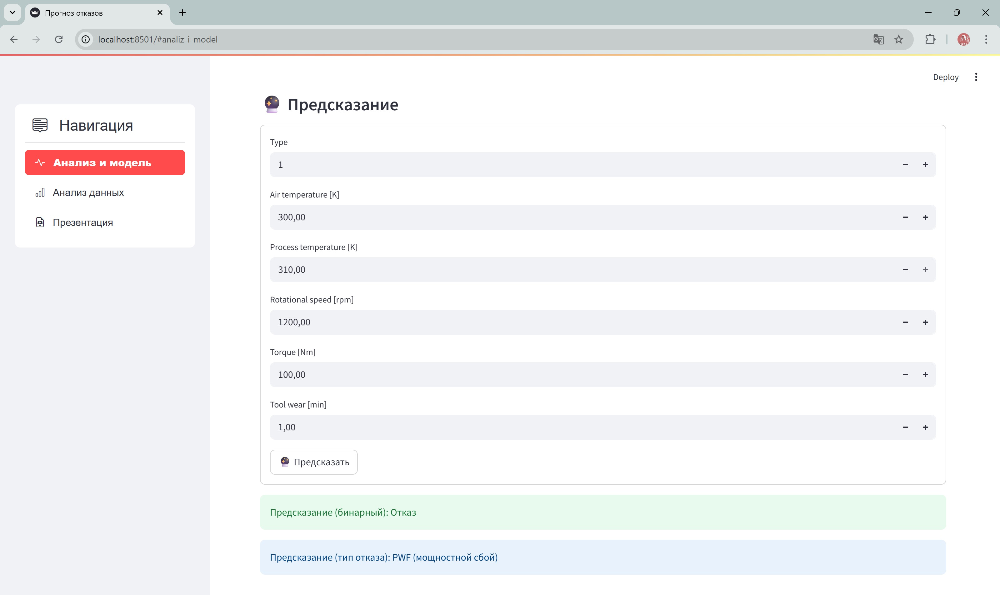

<div id="header" align="center">
    <h1>🎓 Выпускная квалификационная работа</h1>
    <h2>🛠️ Бинарная и  мультиклассовая классификации для предиктивного обслуживания оборудования</h2>
</div>

Работа выполнена в рамках курса **«Data Science. Искусственный интеллект»** цифровой кафедры Казанского национального исследовательского технического университета им. А.Н. Туполева – КАИ.

<!--- Автор работы -->
## :computer: Автор работы :

- :woman_technologist: <a href="https://github.com/space13pirate" title="space13pirate">Черемисова Анастасия</a>, студентка ЦК КНИТУ-КАИ группы № 1

- :round_pushpin: Казань, Россия

- :mag_right: Контакты для связи:

    :e-mail: Эл. почта **CheremisovaAA@stud.kai.ru**

<div id="badges" align="center">
  <a href="https://t.me/space13pirate">
    
  </a>
</div>

---

## :pencil2: Описание проекта

**Цель проекта :** разработать модель машинного обучения, которая предсказывает, произойдёт ли отказ оборудования (`Target = 1`) или нет (`Target = 0`).

В рамках дополнительной работы над проектом были реализованы:

- мультиклассовая классификация типов отказов;
- визуальный анализ данных (EDA);
- улучшенная предобработка;
- более мощные модели машинного обучения;
- оптимизация гиперпараметров;
- MLOps-интеграция с [ClearML](https://clear.ml);
- Docker-интеграция и развёртывание приложения через `docker-compose`.

---

## :bar_chart: Выполненные задачи

### 1. Бинарная классификация
<!-- - **Описание:** предсказание факта отказа оборудования (`Machine failure`: 0 – нет отказа, 1 – отказ) -->
- **Инструменты:** `CatBoostClassifier`
- **Результаты:**
  - Accuracy: **0.988**
  - F1-score (macro avg): **0.79**

### 2. Мультиклассовая классификация
- **Описание:** предсказание типа отказа (`Нет отказа`, `TWF`, `HDF`, `PWF`, `OSF`, `RNF`).
- **Инструменты:** `XGBoostClassifier`
- **Результаты:**
  - Accuracy: **0.9837**
  - F1-score (macro avg): **0.99**

### 3. Визуальный анализ данных (EDA)
- **Описание:** исследование распределения признаков, корреляции и взаимосвязей между ними, построение scatter plot и тепловых карт.
- **Инструменты:** `seaborn`, `matplotlib`

### 4. Предобработка данных
- **Описание:** масштабирование числовых признаков, удаление выбросов по Z-оценке, кодирование категориальных признаков.
- **Инструменты:** `scikit-learn`, `pandas`, `zscore`

### 5. Сравнение и выбор мощных моделей
- **Описание:** тестирование и сравнительный анализ различных алгоритмов машинного обучения для обеих задач.
- **Модели:**
  - ✅ **CatBoostClassifier** – лучший результат на бинарной задаче
  - ✅ **XGBoostClassifier** – лучший результат на мультиклассовой задаче
  - 🔁 **LightGBMClassifier** – высокая скорость, но чуть слабее по метрикам
  - 🧪 **RandomForestClassifier** – стабильный, но уступил градиентным бустингам
  - 🧪 **LogisticRegression** – использована как baseline
  - 🧪 **SVM (Support Vector Machine)** – протестирован, но не показал преимуществ
- **Вывод:** CatBoost – для бинарной классификации, XGBoost – для мультиклассовой.

### 6. Гиперпараметрическая оптимизация
- **Описание:** автоматизированный подбор гиперпараметров с использованием `Optuna` и кросс-валидации (`StratifiedKFold`).
- **Параметры:**
  - `CatBoost`: `depth`, `learning_rate`, `l2_leaf_reg`
  - `XGBoost`: `max_depth`, `learning_rate`, `n_estimators`, `subsample`
- **Результаты:**
  - Бинарная классификация:
    - Accuracy: с **0.987** → **0.9883**
    - F1-score (macro avg): с **0.75** → **0.79**
  - Мультиклассовая классификация:
    - Accuracy: с **0.9837** → **0.9837**
    - F1-score (macro avg): с **0.99** → **0.99**

### 7. Интеграция с MLOps
- **Описание:** интеграция `ClearML` для автоматизации и контроля жизненного цикла ML-проекта:
  - отслеживание экспериментов;
  - управление метриками и артефактами;
  - развёртывание моделей через `ClearML Serving`.
- **Результат:**
  - модели зарегистрированы и отслеживаются в ClearML;
  - подключение к Streamlit UI и возможность предсказаний в реальном времени.

### 8. Интеграция с Docker
- **Описание:** создание контейнера для локального запуска приложения.
- **Состав:**
  - `Dockerfile` – образ с Python, зависимостями и Streamlit
  - `docker-compose.yml` – быстрый запуск через `docker compose`

---

## :card_file_box: Датасет

Использован [AI4I 2020 Predictive Maintenance Dataset](https://archive.ics.uci.edu/dataset/601/predictive+maintenance+data), включающий:

- 10 000 записей
- 14 признаков (напряжение, температура, производственные параметры и др.)
- Цели: бинарная и мультиклассовая классификация отказов

---

## :file_folder: Структура проекта

```text
📦predictive_maintenance_project/
 ┣ 📜 app.py                   # Главная точка входа в Streamlit
 ┣ 📜 analysis_and_model.py    # Модуль с загрузкой датасета, моделей и предсказаниями
 ┣ 📜 data_analysis.py         # EDA и визуализация признаков
 ┣ 📜 presentation.py          # Cтраница презентации проекта
 ┣ 📜 requirements.txt         # Зависимости проекта
 ┣ 📜 Dockerfile               # Сборка Docker-образа
 ┣ 📜 docker-compose.yml       # Запуск с docker-compose
 ┣ 📁 data/                    # Входные данные
 ┣ 📁 experiments/             # Jupyter-ноутбуки и модели
 ┣ 📁 demo/                    # Скриншоты, видео демонстрации работы
 ┗ 📜 README.md                # Документация
```

---

## :globe_with_meridians: Streamlit-приложение

Приложение состоит из следующих страниц:

| 📄 Файл                                            | 📝 Назначение                                |
|----------------------------------------------------|-----------------------------------------------|
| [`app.py`](app.py)                                 | Главный файл Streamlit-приложения             |
| [`analysis_and_model.py`](analysis_and_model.py)   | Анализ данных и предсказания модели           |
| [`data_analysis.py`](data_analysis.py)             | Исследовательский анализ данных               |
| [`presentation.py`](presentation.py)               | Презентация проекта                           |

---

### :film_strip: Демонстрация интерфейса приложения



:link: **Ссылка на видео:** [демонстрация интерфейса приложения](demo/streamlit_interface/streamlit_interface.mp4)

---

## :rocket: Варианты запуска проекта

Проект можно запустить как вручную, так и через Docker. Ниже приведены оба способа.

---

### :white_check_mark: Вариант 1: запуск через Docker (рекомендуемый)

Позволяет изолированно и быстро развернуть приложение без необходимости локальной настройки среды.

#### **0. Перейти в домашнюю директорию** (если необходимо)

* В **cmd.exe** (классической командной строке Windows):

```cmd
cd %USERPROFILE%
```

* В **PowerShell** (которая стала стандартной оболочкой Windows):

```powershell
cd ~
```

или

```powershell
Set-Location ~
```

* В **Unix-подобных оболочках** (например, Git Bash, WSL, Linux, macOS):

```bash
cd ~
```

#### **1. Клонировать репозиторий с GitHub**

```cmd
git clone https://github.com/space13pirate/predictive_maintenance_project.git
```

Перейти в папку проекта:

```cmd
cd predictive_maintenance_project
```

:file_folder: Теперь мы находимся в папке проекта.

#### **2. Создать файл .env с ключами ClearML**

В корне проекта уже есть шаблон `.env.example`. Нужно переименовать его в `.env`.

* В **cmd.exe**:

```cmd
rename .env.example .env
```

* В **PowerShell**:

```powershell
Rename-Item -Path .env.example -NewName .env
```

* В **Unix-подобных оболочках**:

```bash
mv .env.example .env
```

Нужно открыть `.env` и вставить свои ключи доступа ClearML:

```env
CLEARML_WEB_HOST=https://app.clear.ml/
CLEARML_API_HOST=https://api.clear.ml
CLEARML_FILES_HOST=https://files.clear.ml
CLEARML_API_ACCESS_KEY=ваш_ключ_доступа
CLEARML_API_SECRET_KEY=ваш_секретный_ключ
```

:closed_lock_with_key: Эти ключи можно найти в личном кабинете [ClearML](https://app.clear.ml) ([Settings → Workspace](https://app.clear.ml/settings/workspace-configuration) → Create New Credentials).

#### **3. Запустить проект**

```cmd
docker-compose up --build
```

После запуска приложение будет доступно по адресу 👉 http://localhost:8501

---

### :film_projector: Демонстрация запуска проекта (Docker)

:link: **Ссылка на видео:** [запуск проекта (Docker)](demo/project_launch_docker.mp4)

---

### :gear: Вариант 2: локальный запуск без Docker

Подходит для отладки, разработки и запуска на локальной машине с Python.

#### **0. Перейти в домашнюю директорию** (если необходимо)

* В **cmd.exe** (классической командной строке Windows):

```cmd
cd %USERPROFILE%
```

* В **PowerShell** (которая стала стандартной оболочкой Windows):

```powershell
cd ~
```

или

```powershell
Set-Location ~
```

* В **Unix-подобных оболочках** (например, Git Bash, WSL, Linux, macOS):

```bash
cd ~
```

#### **1. Клонировать репозиторий с GitHub**

```cmd
git clone https://github.com/space13pirate/predictive_maintenance_project.git
```

Перейти в папку проекта:

```cmd
cd predictive_maintenance_project
```

:file_folder: Теперь мы находимся в папке проекта.

#### **2. Создать файл .env с ключами ClearML**

В корне проекта уже есть шаблон `.env.example`. Нужно переименовать его в `.env`.

* В **cmd.exe**:

```cmd
rename .env.example .env
```

* В **PowerShell**:

```powershell
Rename-Item -Path .env.example -NewName .env
```

* В **Unix-подобных оболочках**:

```bash
mv .env.example .env
```

Нужно открыть `.env` и вставить свои ключи доступа ClearML:

```env
CLEARML_WEB_HOST=https://app.clear.ml/
CLEARML_API_HOST=https://api.clear.ml
CLEARML_FILES_HOST=https://files.clear.ml
CLEARML_API_ACCESS_KEY=ваш_ключ_доступа
CLEARML_API_SECRET_KEY=ваш_секретный_ключ
```

:closed_lock_with_key: Эти ключи можно найти в личном кабинете [ClearML](https://app.clear.ml) ([Settings → Workspace](https://app.clear.ml/settings/workspace-configuration) → Create New Credentials).

#### **3. Создать и активировать виртуальное окружение**

* В **cmd.exe**:

```cmd
python -m venv venv
venv\Scripts\activate.bat
```

* В **PowerShell**:

```powershell
python -m venv venv
venv\Scripts\Activate.ps1
```

Если команда активации не работает, нужно включить выполнение скриптов:

```powershell
Set-ExecutionPolicy RemoteSigned -Scope CurrentUser
```

Затем снова активировать:

```powershell
venv\Scripts\Activate.ps1
```

* В **Unix-подобных оболочках**:

```bash
python3 -m venv venv (или python)
source venv/bin/activate
```

После этого в командной строке появится префикс (venv) – окружение активно.

**Деактивация окружения** (везде одинаково)**:**

```cmd
deactivate
```

#### **4. Установить зависимости проекта**

```cmd
pip install --upgrade pip
pip install -r requirements.txt
```

#### **5. Запустить Streamlit-приложение**

```cmd
streamlit run app.py
```

Если streamlit не найден:

```cmd
python -m streamlit run app.py
```

После запуска приложение будет доступно по адресу :point_right: http://localhost:8501

---

### :film_projector: Демонстрация запуска проекта (локально)

:link: **Ссылка на видео:** [запуск проекта (локально)](demo/project_launch_local.mp4)
